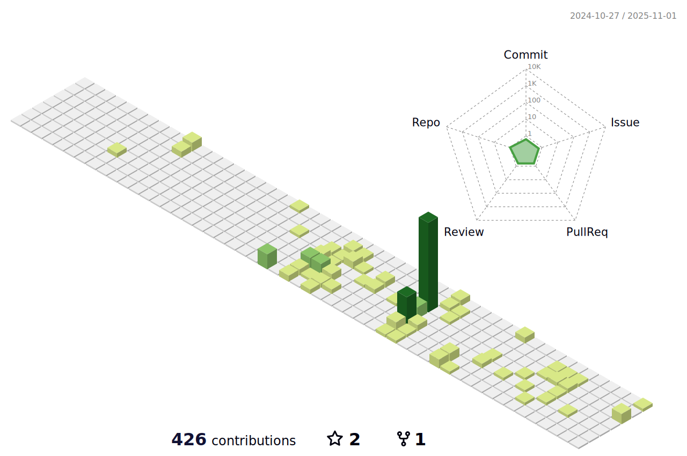

# Hi there 👋

I'm passionate about developing innovative and creative projects that help to make the world a better place. I'm continually learning and expanding my skills, and I'm not afraid to take on new challenges.

---

## Connect with me 🌍

  

 

---

## 🛠 Tech Stack

Here are a few things I've picked up along my learning journey.

* 📱 Mobile development:
  

* 💻 Frontend development:
  
  
  
  

* 🕹 Backend development:
  
  
  

* ☁️ Cloud & Hosting:
  
  
  

* 🗄 Databases:
  
  

* 🧰 Other Tools:
  
  

---

